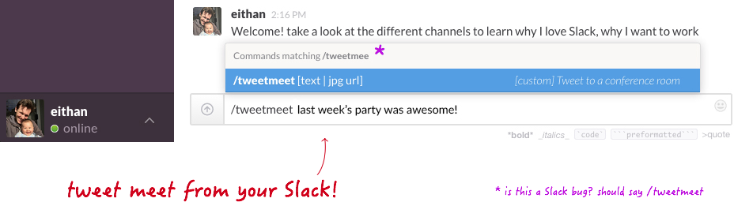

# SlackTweetMeet

Some companies have iPads in conference rooms that help manage the room's schedule. I thought it would be cool to use these iPads to show content posted by people working in the company. This content (or private 'tweets') can be fun quotes or photos to display in the workplace.

I've created a simple iPad app that presents tweets from a circular queue in the cloud. The app displays the content of the tweet, be it photos or text. It also presents who posted it, as well as an indicator to show the state of the conference room's vacancy.

Anyone within a company can easily post anything using a convenient Slack [slash command](https://slack.zendesk.com/hc/en-us/articles/201259356-Using-slash-commands).

The *slash command* is sending a POST request to a server that records the tweet in a database. The app polls the database every time it wants to display the next tweet.  
In this case I used Parse to listen to the POST requests, and to host the data. They just make it so easy to do. But in a real deployment this could easily be ported to the company's servers.

### To Do

Due to time constraints, this is a very quick implementation. A bunch of stuff to do next:

* Better data validation when syncing from cloud
* Nicer transitions between tweets
* Web GUI to control the system's preferences
* Content awareness for URLs in tweets, etc
